# Image processing

See `./image-processing/`

## 1. Convolution

Операции свертки и Фурье-анализ    
- свертка изображений с ядрами
- базис Фурье
    
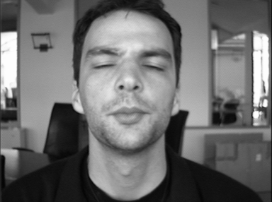 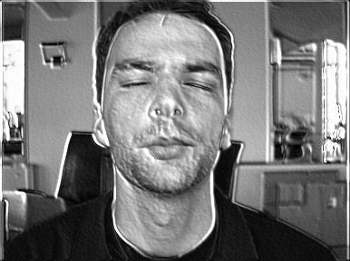 

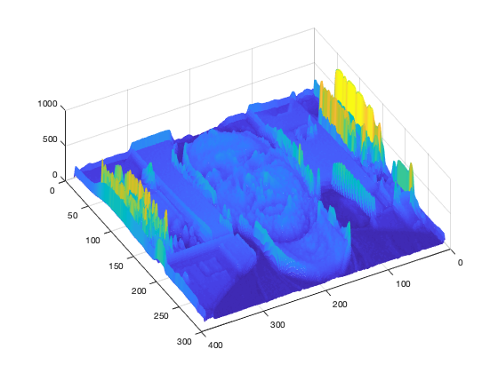
    
    
## 2. Fourier

Преобразование Фурье. Спектры изображений


## 3. Contours

Контуризация
- Выделение контуров на изображении
    - дифференциальный метод
    - thresholding
    - skeletonization
    - non-maximum supression (NMS)
    - статистический метод
- Кодирование границ изображения
    - по трем признакам
    - трехразрядным кодом
    - проекциями
    - координатами концов векторов
    - восемью комплексными числами
    - в полярных координатах
    
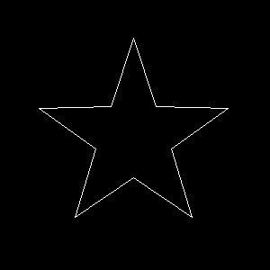 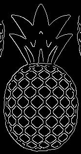 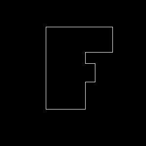
        
## 4. Haralick

Параметры Харалика
- Классификация текстур методами кластеризации
    
    
    
    
# Computer vision & machine learning

Prerequisites

- make user python 3.7 is used. ml shit doesnt support 3.8
- set up and activate venv
```bash
pip3 install virtualenv
virtualenv venv --python python3.7
source venv/bin/activate
pip install -r requirements.txt 
```


## 1. Augmentation

Реализовать программу (python или C++), на вход которой подаётся изображения, а на выходе должно быть несколько изображений:

- Повороты этого изображения на некоторый угол
- Смещение этого изображения по оси x и по оси y
- Сжатие и растяжение
- Параллельный перенос
- Симметрия

see `./augmentation`

```python
ImgEditor('source.png') \
    .rotate(RotationPoint.CENTER, angle=10) \
    .shrink(x_factor=0.9) \
    .translate(y_offset=20) \
    .save('dest.png')
```

#### Original & Augmented

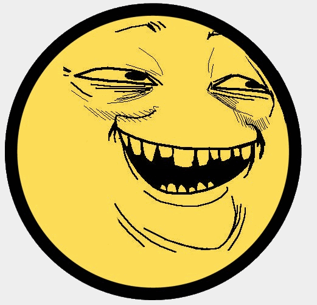 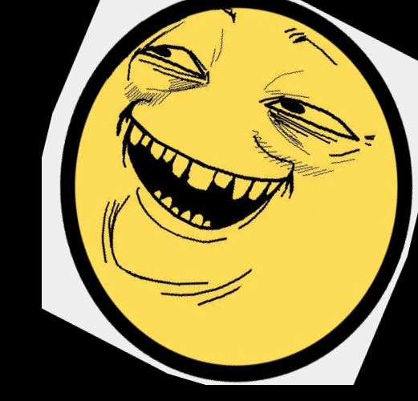


## 2.1. Square detector

Для выбранных изображений реализовать распознавание границ геометрических фигур. 
Распознанные границы нанести на рисунок (другим цветом).

see `./square_contours`

#### Original & Detected

 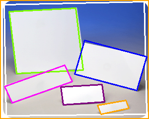


## 2.2. Blur detector

Реализовать алгоритмы распознавания размытого изображения и региона
- Tenengrad (TENG)
- Normalized Gray Level Variance (GLVN)

Для региона указать координаты размытого региона на изображении.

see `./blur`

#### Original

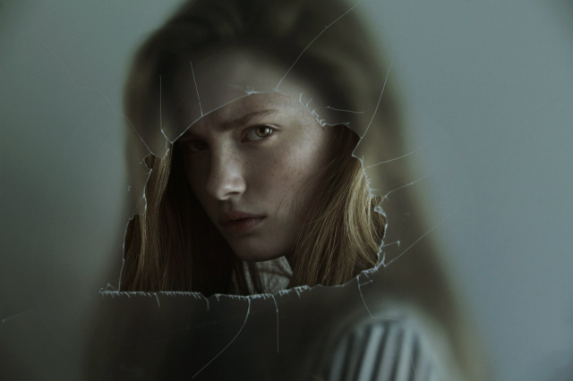

#### Teng & GLVN

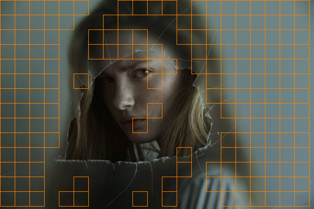 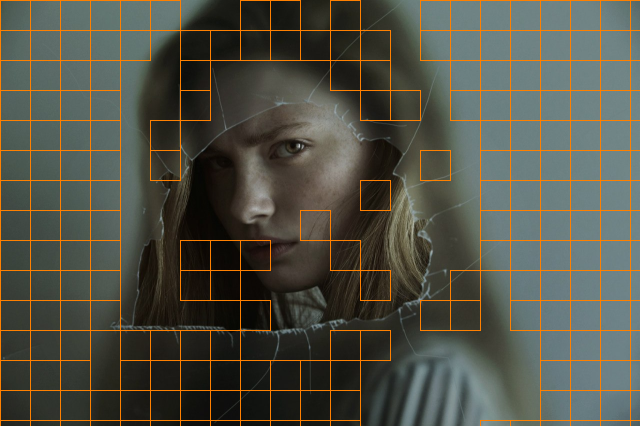


## 3. Support Vector Machine (SVM from scratch)

Реализовать алгоритм обучения с учителем - метод опорных векторов самостоятельно. 

Была реализована наивная, учебная визуализированная версия. 
Т.к. версия учебная, то работает только для линейно разделимых наборов данных.

See `./svm`

```python
# fit to data
labeled_data = {
    'a': [Point(10, 20), Point(13, 37), Point(14, 48)],
    'b': [Point(-5, 16), Point(12, 90), Point(40, 30)]
}

svm = SVMFromScratch()
svm.fit(labeled_data)

# predict new data
predicted_clazz = svm.predict(Point(70, 40))
```


#### In action

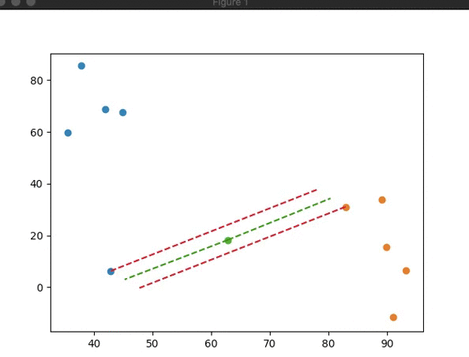

#### Result

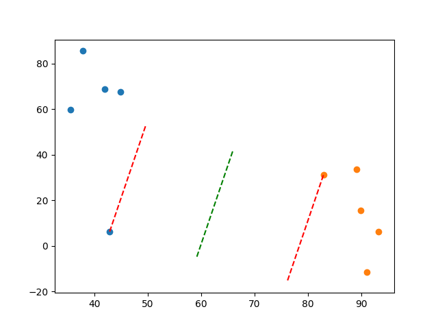


## 4. Classic CV. Face rec with Haar cascades

Необходимо реализовать алгоритм компьютерного зрения с использованием алгоритмов «классического» компьютерного зрения, 
без использования нейронных сетей для решения задачи классификации лиц.

Использованы Каскады Хаара.

See `./face_rec_classic`


#### Extracted face and predicted face

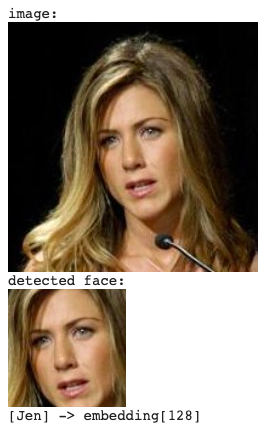 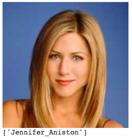


## 5. Neural Network architecture

Необходимо реализовать архитектуру нейронной сети. Была реализована архитектура AlexNet

see `./alex`


## 6. NN-based CV. Face rec with neural networks

Необходимо реализовать алгоритм компьютерного зрения с использованием нейронных сетей. 

see `./face_rec_neural`


## 7. Semantic segmentation. Roadlane detection

Дано
- [массив изображений](https://www.dropbox.com/s/rrh8lrdclzlnxzv/full_CNN_train.p?dl=0)
- [массив дорожных разметок](https://www.dropbox.com/s/ak850zqqfy6ily0/full_CNN_labels.p?dl=0)

Обучить алгоритм распознавания дорожной разметки с помощью любой наиболее подходящей архитектуры семантической сегментации.

В train датасете по ссылкам выше - около 13к изображений следующего вида:

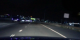 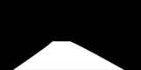 

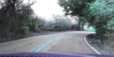 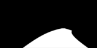

Чтобы программа отрабатывала в разумные сроки, обучающая выборка была уменьшена до 1000 изображений 
(взяты изображения 1000..2000), а количество эпох - до 5. 

Очевидно, общее качество предсказания снизилось, но время работы программы таким образом составляет около 5 минут,
что приемлемо в рамках лабораторной работы.
 
see `./roadlane`

Видео/gif ниже - пример предсказания дорожной разметки моделью, обученной на данных выше.
Были поданы изображения, не участвовавшие в обучении (изображения с 800..999) и результат предсказания склеен в видео.

#### Original

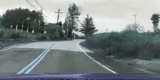

#### Detected

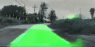 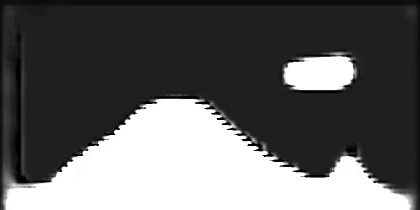

Была использована FCN8 архитектура с немного измененными рамерностями:

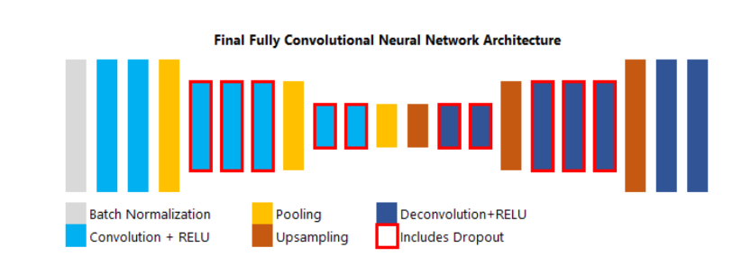
